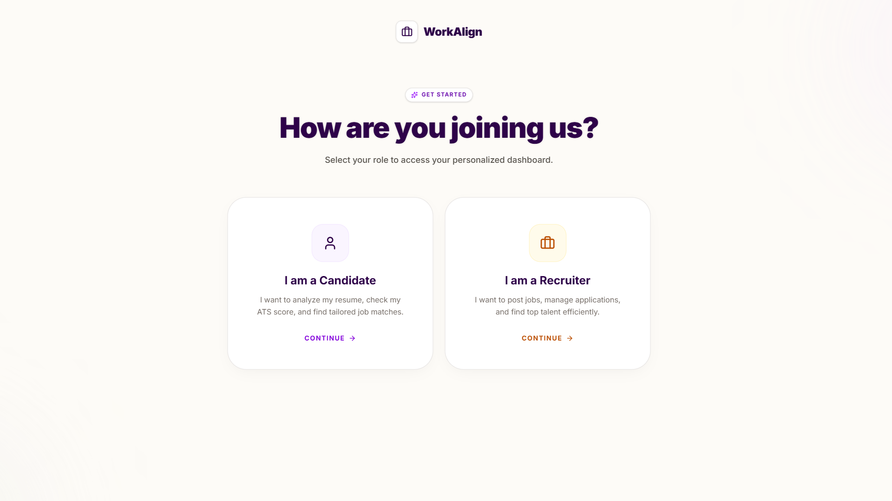
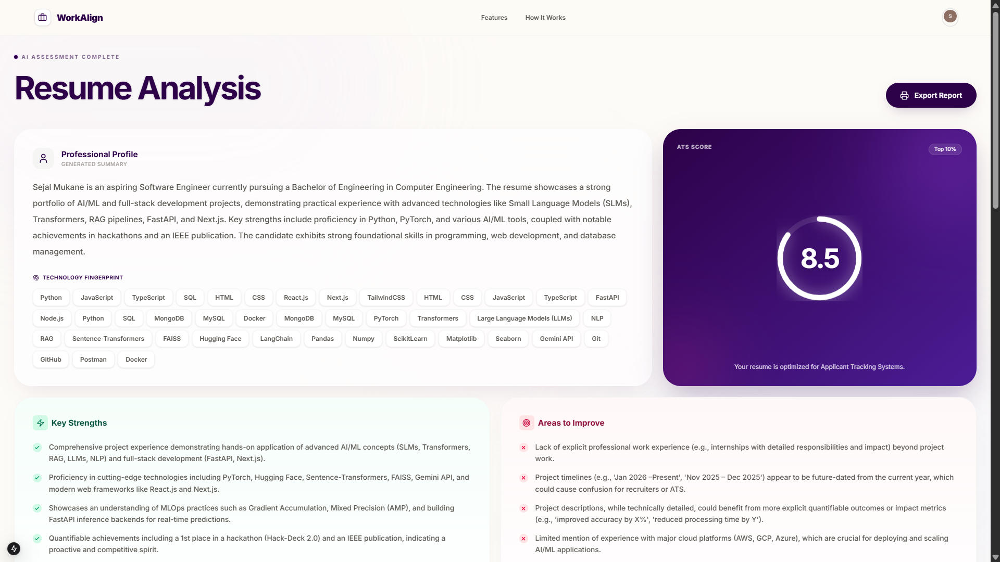
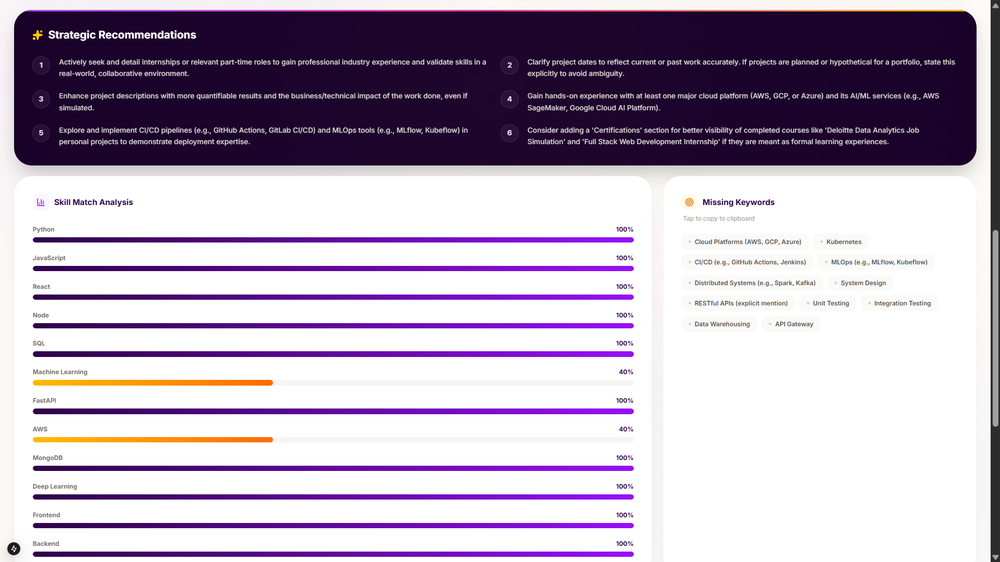
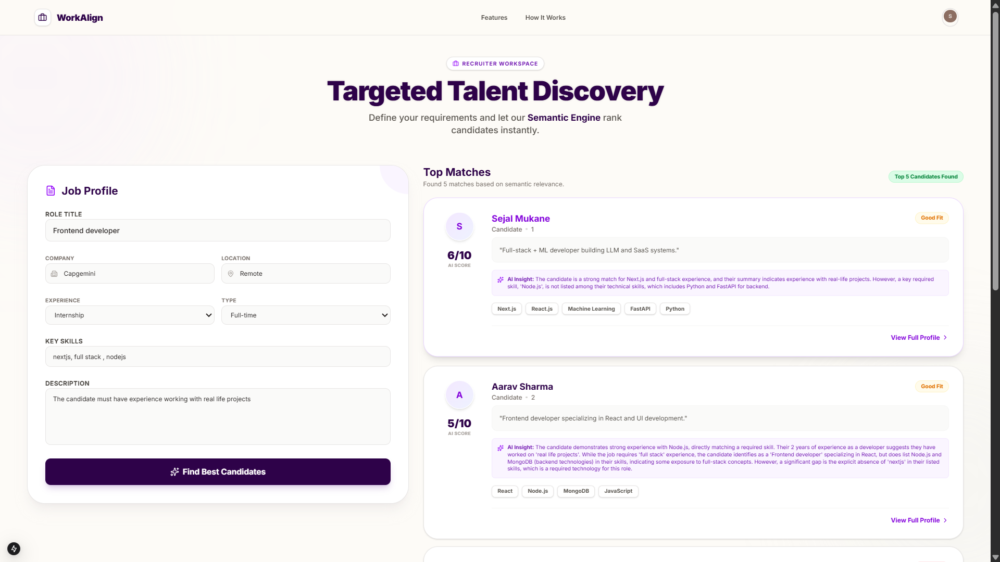

## 🌟 WorkAlign — AI Powered Recruitment Platform

WorkAlign is an AI-driven recruitment platform that helps candidates and recruiters make smarter hiring decisions through resume intelligence, semantic matching, and AI ranking.

It creates a two-sided intelligent hiring ecosystem where:
- Candidates understand their career alignment
- Recruiters discover the most relevant talent instantly

---

## 🚀 Product Overview

Hiring today is slow, manual, and error-prone.

WorkAlign replaces keyword matching with AI semantic understanding to:
- Analyze resumes
- Parse job descriptions
- Score alignment
- Rank candidates intelligently

---

## 🖥️ Product Walkthrough

### Landing Page


### Role Selection


### Candidate Resume Analysis


### Candidate Recommendations & Skill Match


### Recruiter Dashboard


---

## 🧠 Core Features

### Candidate Side
- AI Resume Analysis
- Skill Extraction & Role Fit
- ATS Optimization Score
- Transparent Feedback

### Recruiter Side
- AI Job → Candidate Matching
- Intelligent Candidate Ranking
- Reduced Manual Screening
- Data-Driven Shortlisting

---

## 🤖 AI Capabilities
- NLP Resume Understanding
- Job Description Parsing
- Embedding Similarity Matching
- AI + Rule-Based Ranking Engine

---

## 🏗️ Tech Stack

Frontend:
- Next.js
- Tailwind CSS

Backend:
- Node.js
- FastAPI

AI/ML:
- Resume Parsing
- Embedding Similarity Matching
- Ranking Engine

---

## 📂 Project Structure

WORKALIGN/
- app/
- backend/
- screenshots/
- public/
- lib/
- tmp/
- package.json

---

## ⚙️ Setup Instructions

### Clone Repository

```bash
git clone https://github.com/SejalMukane/workalign.git
cd workalign

## Frontend Setup:
npm install
npm run dev

## Backend:

## Windows:
python -m venv venv
venv\Scripts\activate

## Mac/Linux:
python3 -m venv venv
source venv/bin/activate

pip install -r requirements.txt
cd backend
uvicorn main:app --reload

---

### Then push

```

## 👩‍💻 Author
Sejal Mukane
https://github.com/SejalMukane
